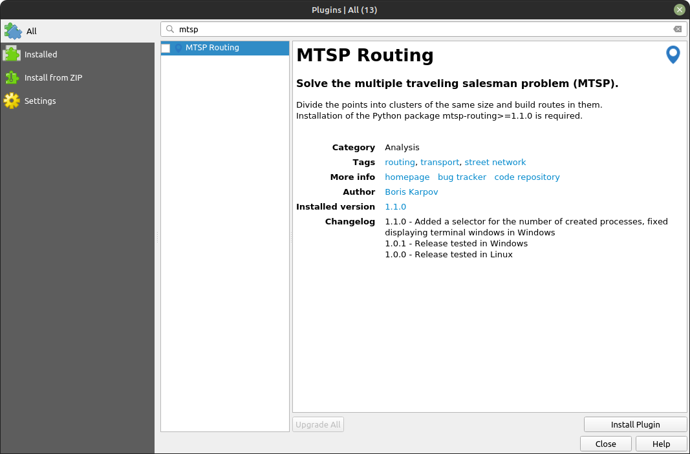
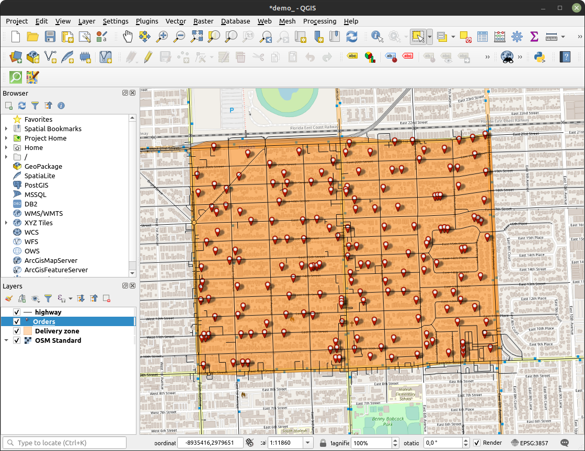
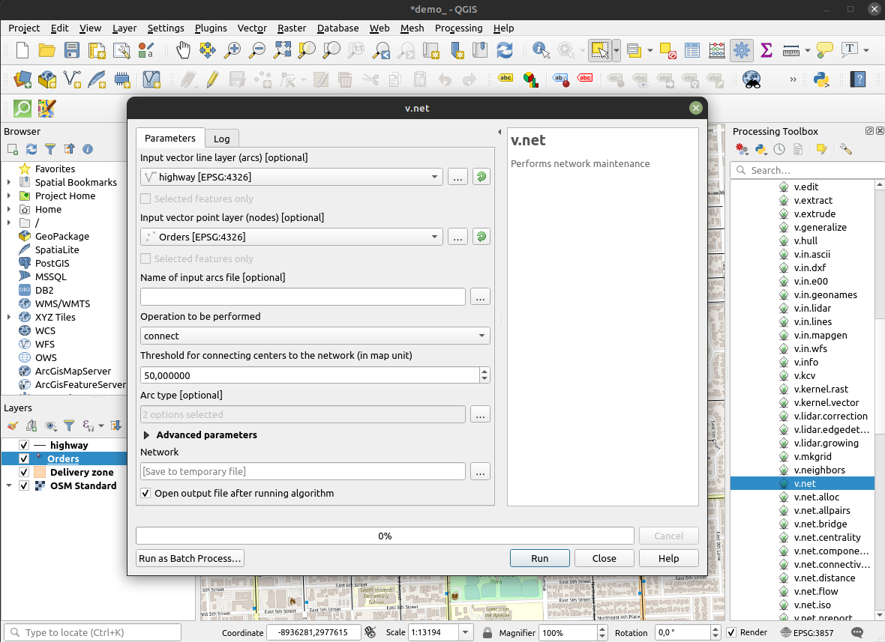
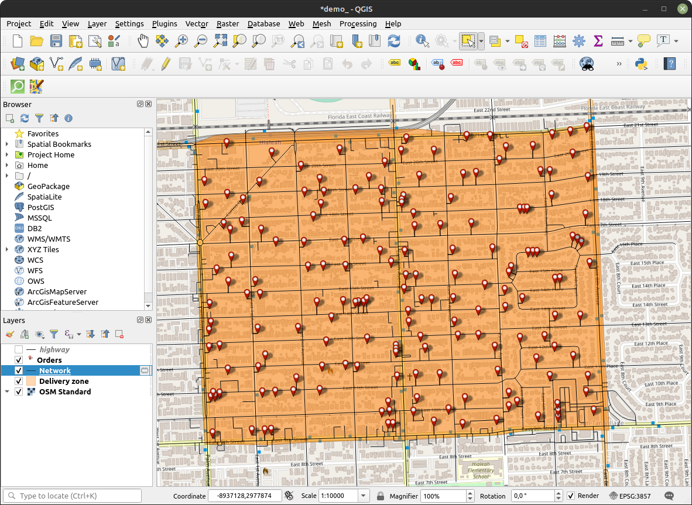
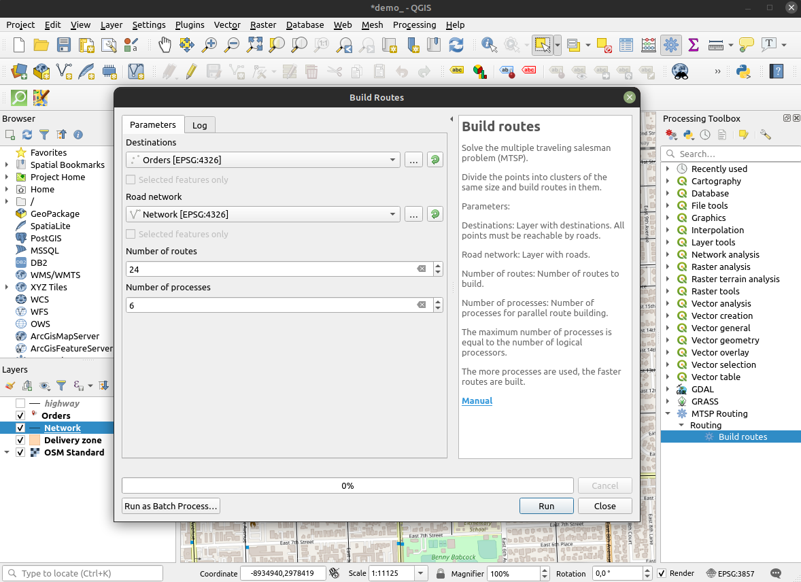
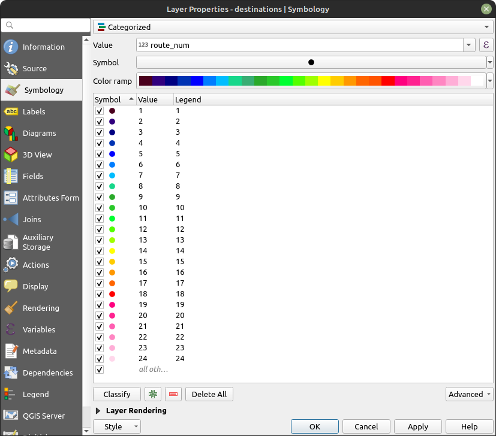
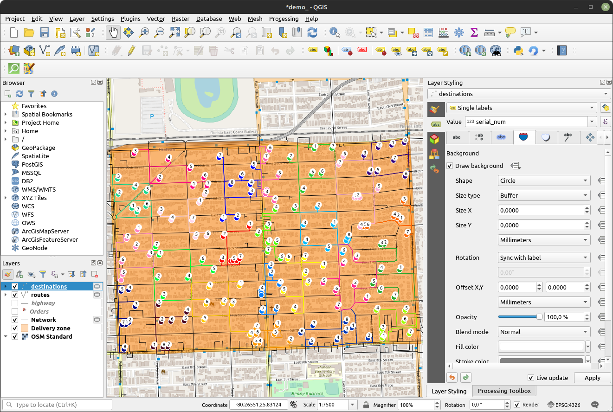

# mtsp-routing-qgis

[RU](https://github.com/bkarpov/mtsp-routing-qgis/blob/main/README.ru.md)

Plugin for QGIS to solve multiple traveling salesman problem (MTSP).

Calculations are performed by the mtsp-routing-core package
([GitHub](https://github.com/bkarpov/mtsp-routing-core),
[PyPI](https://pypi.org/project/mtsp-routing/)), which is not tied to any GIS.


---

## Installation

### I. Installing the latest version of the Python package mtsp-routing

The package is needed to perform calculations, without it the QGIS plugin will not be able to work.

#### Installing in QGIS
1. Open the Python Console
2. Execute commands
```python
import pip
pip.main(["install", "mtsp-routing"])
```
 
#### Installation via terminal in Linux

Open the terminal and execute the command ```python -m pip install mtsp-routing```

#### Installation via terminal in Windows

Open the OSGeo4W terminal (installed with QGIS) and run the command ```python -m pip install mtsp-routing```

### II. Installing the QGIS plugin "MTSP Routing"

Plugins / Manage and Install Plugins


---

## Example

### 1. Prepare data
   1. Add an OSM map from the QuickMapServices plugin

   2. Create a polygon with a delivery zone

   3. Downloads roads included in the delivery area using the QuickOSM plugin
      1. Vector / QuickOSM / QuickOSM


   4. Add a layer with destinations

   5. Connect destinations to the road network using the GRASS plugin
      1. Processing Toolbox / GRASS / Vector (v.*) / v.net



### 2. Run the algorithm


### 3. Configure the display of the result
   1. Classify destinations by the route_num attribute

   2. Classify used roads by the route_num attribute

   3. Add labels to destinations

   4. Add labels showing the order of road traversal
      1. To prevent signatures from merging into 1 number, use an expression with the addition of a separator 

