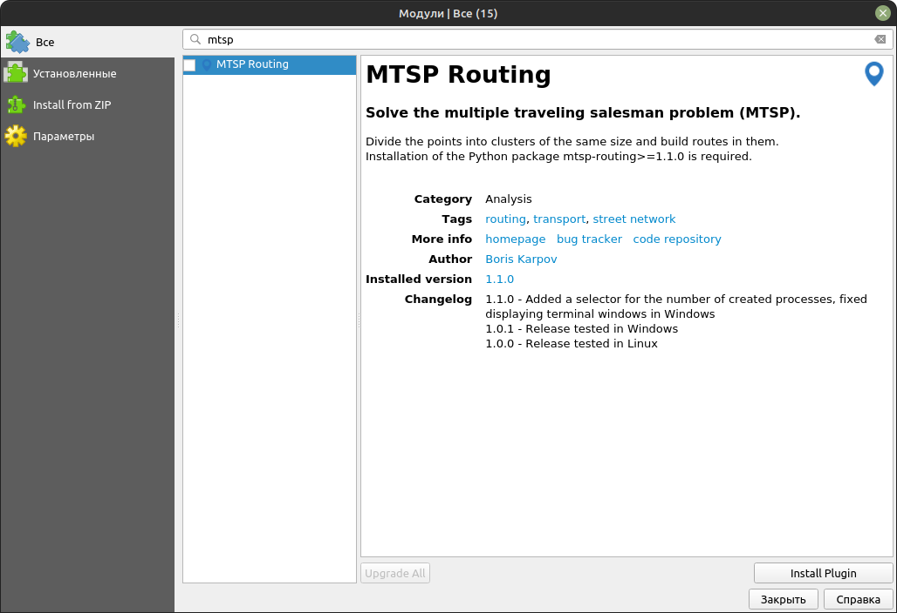
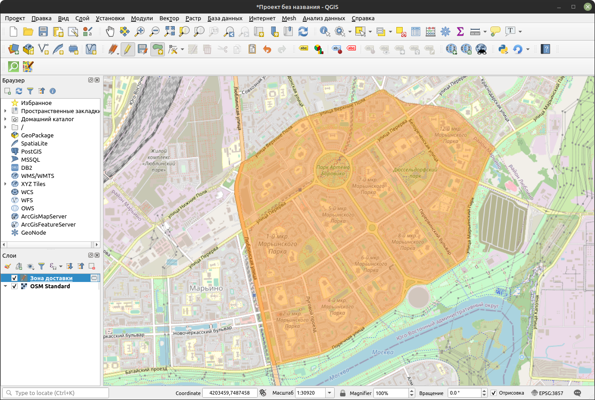
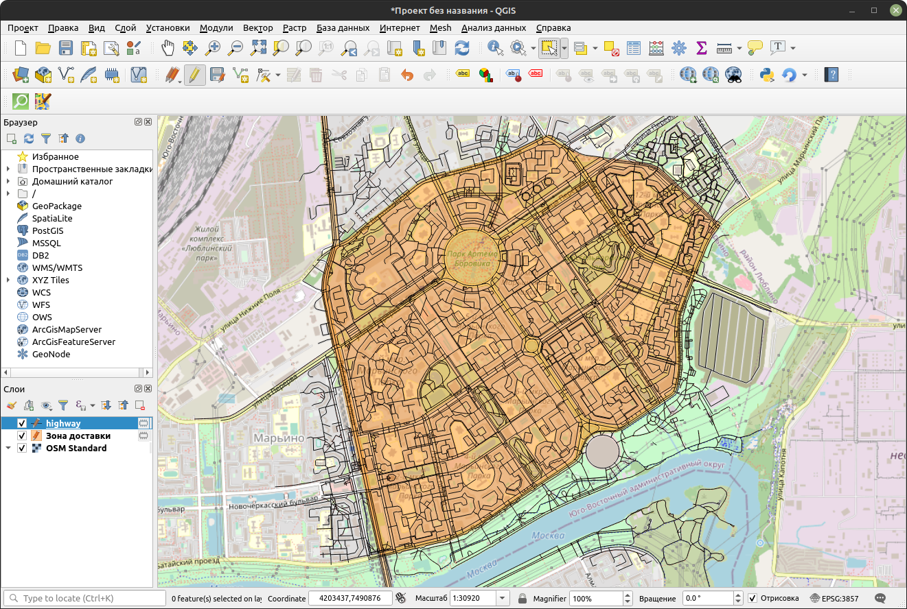
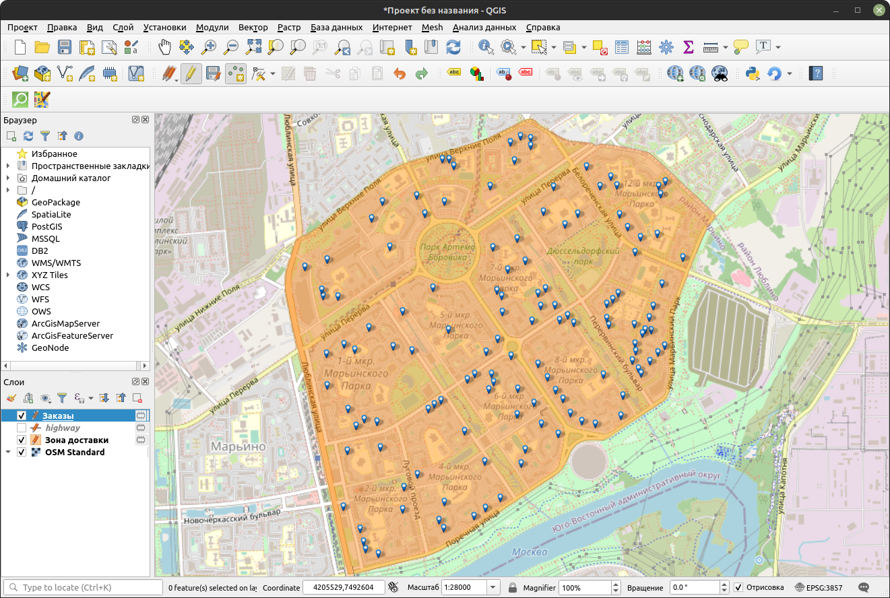
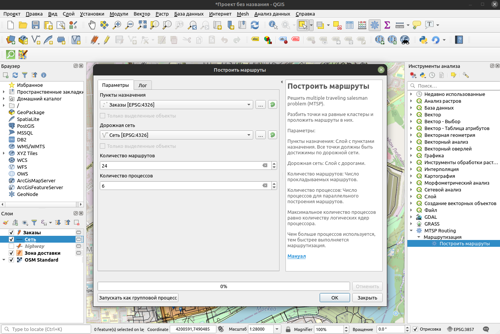
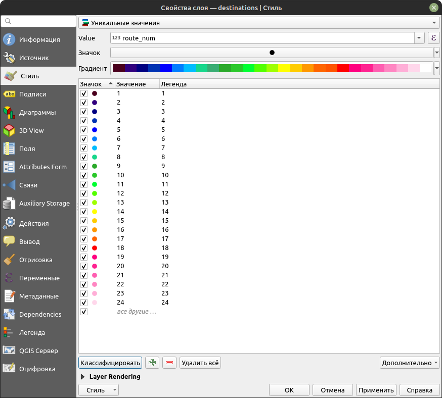
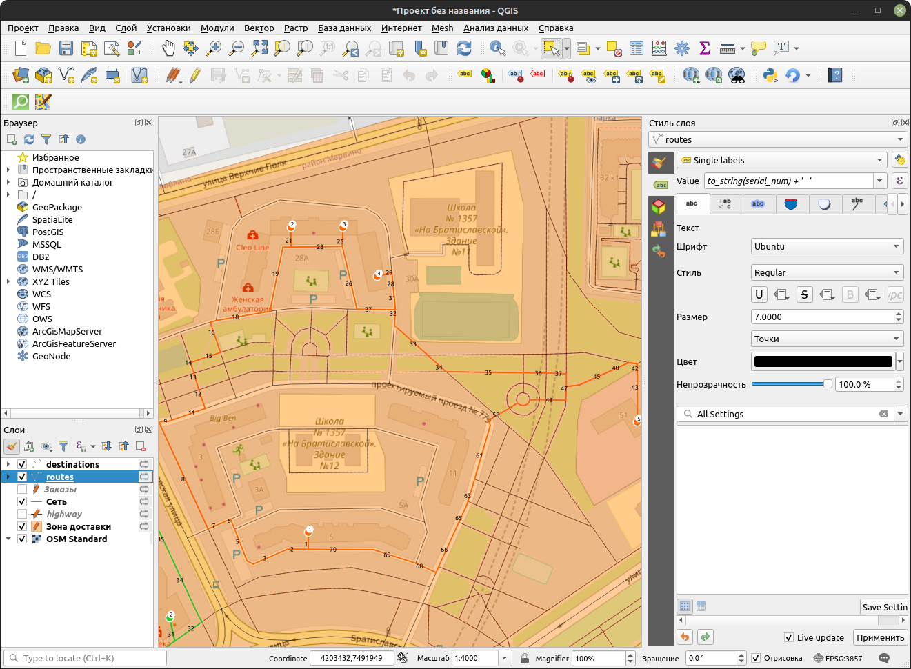

# mtsp-routing-qgis

[EN](https://github.com/bkarpov/mtsp-routing-qgis/blob/main/README.md)

Плагин для QGIS для решения multiple traveling salesman problem (MTSP).

Вычисления выполняются пакетом mtsp-routing-core
([GitHub](https://github.com/bkarpov/mtsp-routing-core),
[PyPI](https://pypi.org/project/mtsp-routing/)), не привязанным к какой-либо ГИС.

---

## Установка

### I. Установка Python пакета mtsp-routing

Пакет нужен для выполнения вычислений, без него плагин QGIS не сможет работать. 

#### Установка в QGIS
1. Открыть консоль Python
2. Выполнить команды
```python
import pip
pip.main(["install", "mtsp-routing"])
```
 
#### Установка через терминал в Linux

Открыть терминал и выполнить команду ```python -m pip install mtsp-routing```

#### Установка через терминал в Windows

Открыть терминал OSGeo4W (устанавливается вместе с QGIS) и выполнить команду ```python -m pip install mtsp-routing```

### II. Установка QGIS плагина "MTSP Routing"

Модули / Управление и установка модулей


---

## Пример

### 1. Подготовить данные
   1. Добавить карту OSM из плагина QuickMapServices

   2. Создать полигон с зоной доставки

   3. Выгрузить дороги, входящие в зону доставки с помощью плагина QuickOSM
      1. Вектор / QuickOSM / QuickOSM


   4. Добавить слой с пунктами назначения

   5. Подключить пункты назначения к дорожной сети с помощью плагина GRASS
      1. Инструменты анализа / GRASS / Инструменты обработки векторных данных / v.net


### 2. Запустить алгоритм


### 3. Настроить отображение результата
   1. Классифицировать пункты назначения по атрибуту route_id

   2. Добавить подписи к пунктам назначения

   3. Классифицировать использованные дороги по атрибуту route_id

   4. Добавить подписи к использованным участкам дорог
      1. Чтобы подписи не сливались в 1 число, использовать выражение с добавлением разделителя 

